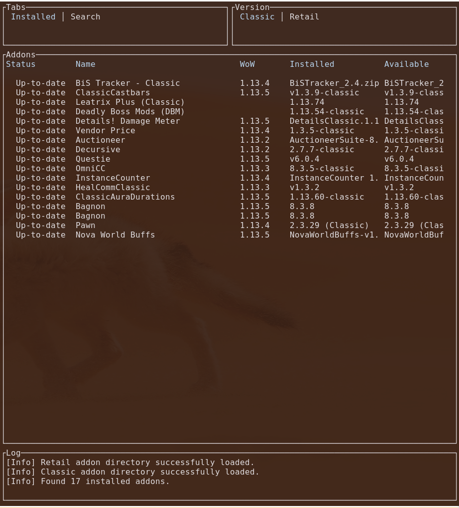
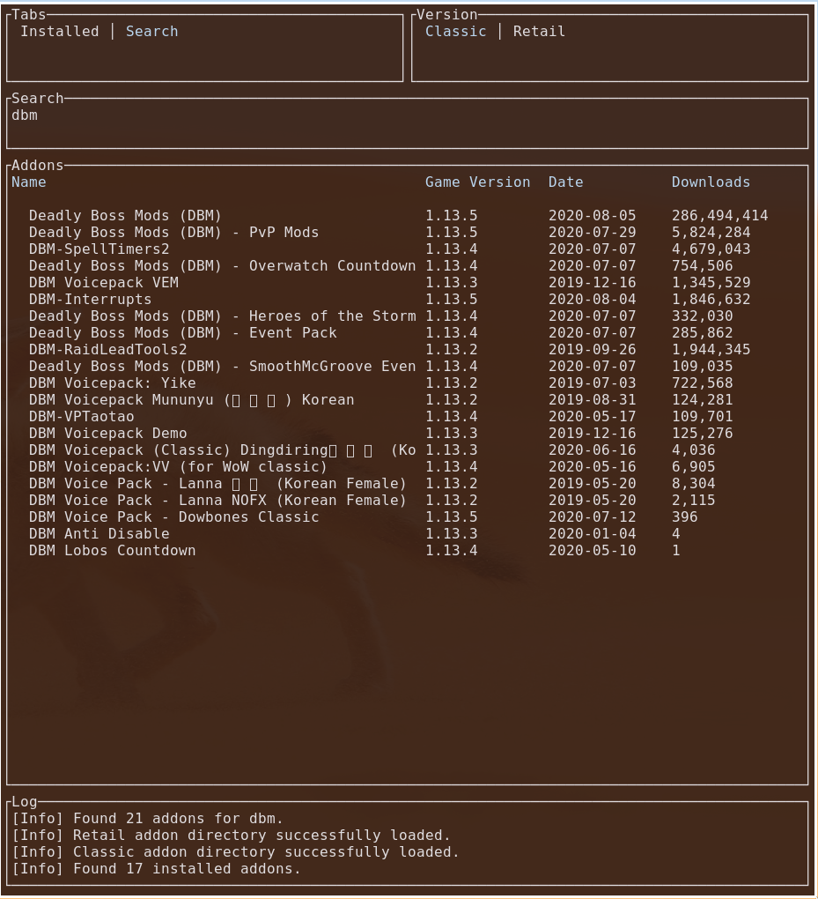

# wowAddonManager

This is an open source World of Warcraft addon managager for Linux. It supports the following addon repositories:

- [Curseforge](https://www.curseforge.com/)

## Screenshots

 

## Requirements

- Rust 1.43.0

This project uses [Termion](https://gitlab.redox-os.org/redox-os/termion) for communicating with the TTY. Therefore, it only runs on Linux. In order to support Windows and macos, [Crossterm](https://github.com/crossterm-rs/crossterm) might be a better solution. If there is enough demand, I might consider switching to Crossterm.

## Installation

### Source

1. Make sure you have [Rust](https://rustup.rs/) installed 
2. Clone the repository: `git clone https://github.com/MR2011/wowAddonManager.git`
3. Run with `cargo run`

### Cargo

Coming soon

## Configuration

The `Config.toml` configuration file is stored in `$HOME/.config/wowAddonManager` (or if set `$XDG_CONFIG_HOME/wowAddonManager`). 

### Important

Before you run the program for the first time, you have to define the path to your World of Warcraft addon folders in the configuration file:

```
[paths]
classic = "/path/to/wow/classic/interface/addons"
retail = "/path/to/wow/retail/interface/addons"
```

Default keybindings:

```
[keybindings]
update_addon = "u"
update_all_addons = "U"
remove_addon = "r"
download_addon = "d"
install_addon = "i"
select_retail_version = "R"
select_classic_version = "C"
search_addon = "/"
next_tab = "l"
prev_tab = "h"
next_table_item = "j"
prev_table_item = "k"
quit = "q"
scroll_down_log = "J"
scroll_up_log = "K"
```

## Notes

- This program creates a file called `.addons.json` in your addon folders to manage your addons. There is no addon detection for already installed addons for now, so you have to install your addons again with the wow addon manager.
